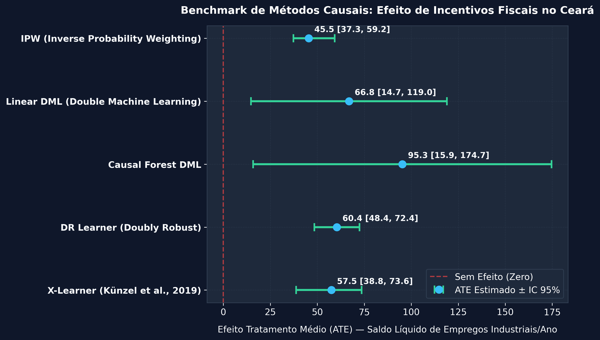
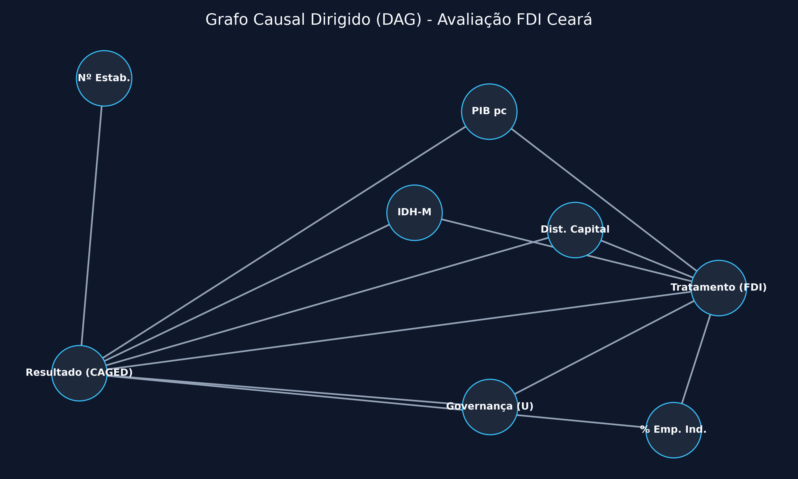
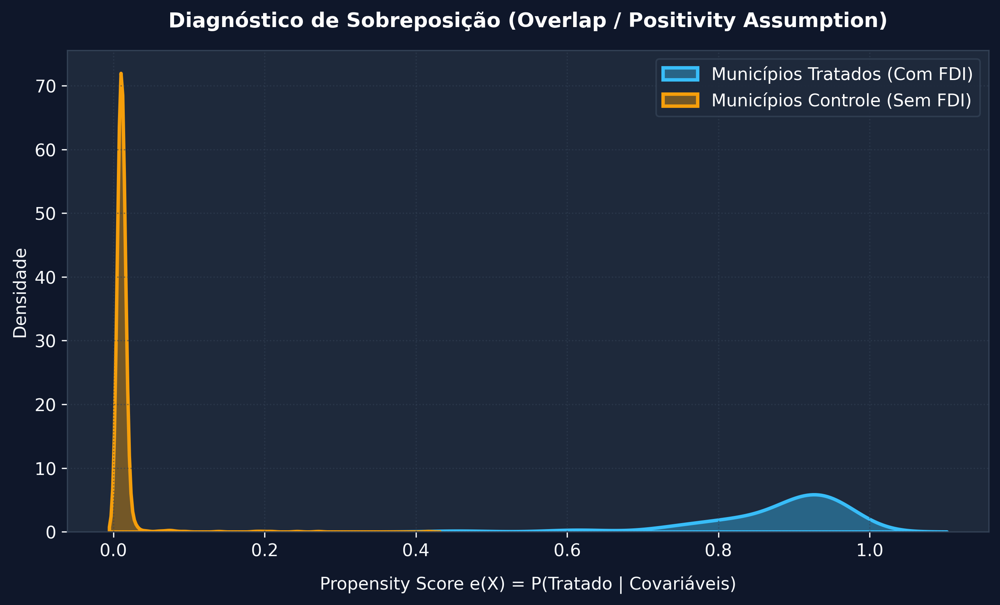
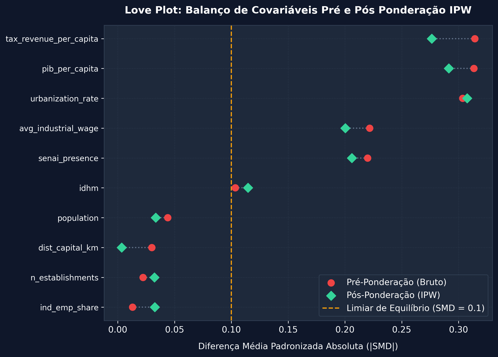
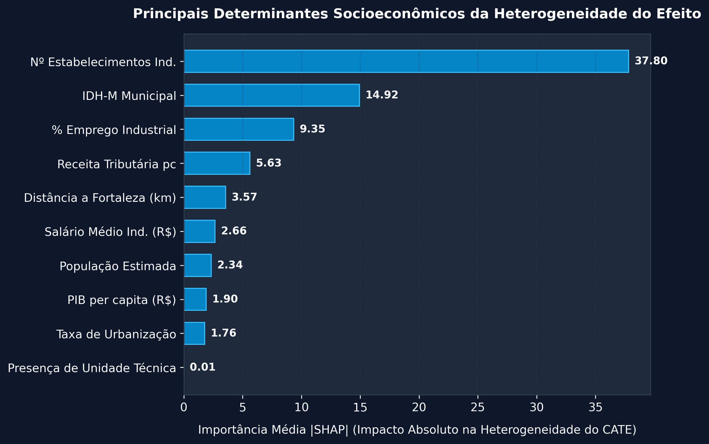
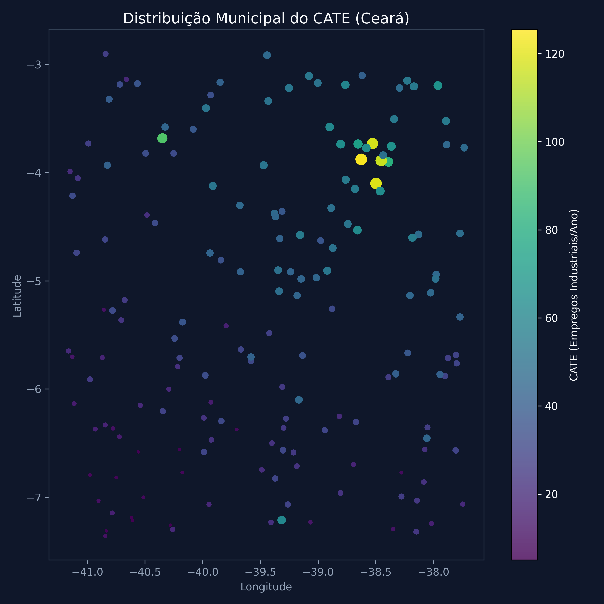
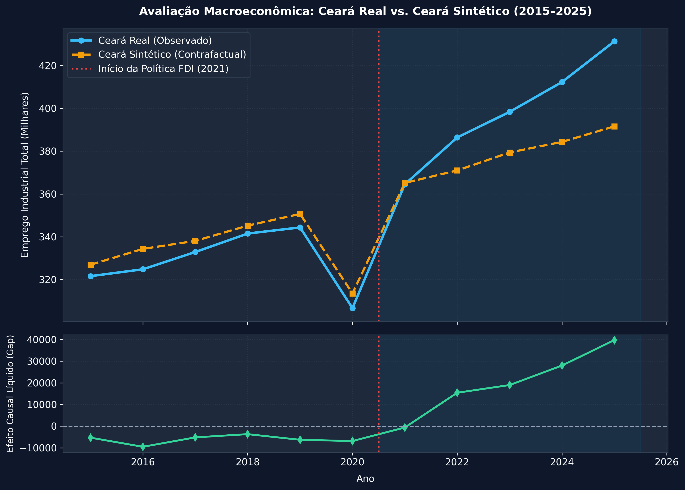
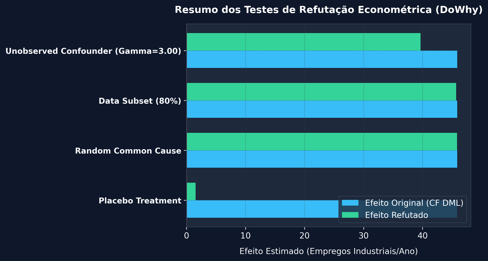

# Industrial Causal Policy: Benchmark de Inferência Causal para Avaliação de Políticas Industriais no Ceará

[](https://www.python.org/)
[](LICENSE)

Framework em Python para mensuração do **efeito causal heterogêneo de incentivos fiscais industriais (ICMS via FDI)** sobre a geração de empregos formais nos municípios do Ceará (2020–2025). Desenvolvido como prova de conceito para um **Centro de Inteligência Industrial**.

> [!IMPORTANT]
> **Nota sobre os Dados & Propósito Econométrico**: Este repositório utiliza dados sintéticos gerados por um Processo Gerador de Dados (DGP) rigorosamente calibrado com base na estrutura socioeconômica do Ceará. Os resultados estatísticos apresentados são artefatos do DGP para fins de benchmark metodológico e demonstração da arquitetura de Causal ML, e não estimativas empíricas finais de avaliação de impacto governamental.

---



---

## 1. Motivação Institucional

A avaliação de políticas de desenvolvimento industrial no Brasil historicamente padece da dependência exclusiva de métricas descritivas (ex.: contagem de admissões brutas ou volume absoluto de renúncia fiscal) ou modelos preditivos supervisionados não causais. Essas abordagens falham em responder à questão contrafactual fundamental: *quantos empregos teriam sido criados no município na ausência da concessão do incentivo fiscal?* Além disso, a presença de viés de seleção — municípios mais próximos da capital ou com melhor infraestrutura prévia são mais propensos a atrair empresas incentivadas — exige o uso de métodos econométricos que garantam identificação causal crível.

Este repositório preenche essa lacuna ao implementar uma suíte de **Causal Machine Learning** baseada nos avanços econométricos recentes de Chernozhukov et al. (2018), Wager & Athey (2018) e Künzel et al. (2019). O framework permite a um **Centro de Inteligência Industrial** identificar não apenas o efeito médio agregado da política (ATE), mas a distribuição municipal detalhada dos efeitos causais heterogêneos (CATE), fornecendo subsídios quantitativos para a otimização da alocação regional dos incentivos do Fundo de Desenvolvimento Industrial (FDI).

---

## 2. Pergunta de Pesquisa

> *"Qual é o efeito causal heterogêneo de incentivos fiscais industriais (isenção/redução de ICMS via FDI) sobre o emprego formal industrial nos municípios do Ceará, e como esse efeito varia por setor CNAE, porte do estabelecimento e características socioeconômicas do município?"*

---

## 3. Dados e Covariáveis

A base analítica é gerada por um **Processo Gerador de Dados (DGP)** calibrado com estatísticas descritivas públicas, na granularidade **município × setor CNAE 2.0 (divisão 2 dígitos) × ano (2020–2025)**. As fontes de referência para calibração dos parâmetros são:

| Variável | Papel Econométrico | Fonte de Dados | Descrição / Granularidade |
|---|---|---|---|
| **`net_job_gain`** | Outcome ($Y$) | Novo CAGED (MTE) | Saldo líquido de empregos formais (admissões − desligamentos) |
| **`fdi_incentive`** | Tratamento ($T$) | SEFAZ-CE / Diário Oficial | Dummy binária de concessão de incentivo fiscal ICMS via FDI |
| **`pib_per_capita`** | Confundidor ($X$) | IBGE — PIB dos Municípios | PIB municipal per capita em R$ |
| **`idhm`** | Confundidor ($X$) | PNUD / Atlas Brasil | Índice de Desenvolvimento Humano Municipal (0 a 1) |
| **`dist_capital_km`** | Confundidor ($X$) | Cálculo Haversine | Distância espacial em km até a capital (Fortaleza) |
| **`senai_presence`** | Confundidor ($X$) | Dados de Infraestrutura | Dummy indicadora de unidade física de capacitação técnica |
| **`ind_emp_share`** | Confundidor ($X$) | RAIS | Proporção de emprego industrial sobre o emprego formal total |
| **`n_establishments`**| Covariável ($X$) | RAIS | Número de estabelecimentos industriais ativos |
| **`avg_industrial_wage`**| Covariável ($X$) | Novo CAGED / RAIS | Salário médio industrial formal (R$) |
| **`urbanization_rate`**| Covariável ($X$) | IBGE Censo | Taxa de urbanização municipal (%) |
| **`tax_revenue_per_capita`**| Covariável ($X$) | FINBRA / Tesouro Nacional| Receita tributária municipal per capita (R$) |

---

## 4. Metodologia

```
[ Grafo Causal (DAG) ] ──> [ Estimação (5 Métodos Micro + 1 Macro) ] ──> [ Controle Sintético ] ──> [ Refutação (DoWhy) ] ──> [ Heterogeneidade (SHAP) ]
```



### 4.1 Métodos Causais Comparados

O repositório implementa **5 métodos causais de nível micro** mais **1 análise macroeconômica complementar**:

1. **IPW (Inverse Probability Weighting)**: Baseline não-paramétrico ponderado pelo inverso do propensity score $e(X) = P(T=1\mid X)$ estimado via `GradientBoostingClassifier`.
2. **Linear DML (Double Machine Learning)**: Baseline semi-paramétrico com ortogonalização de resíduos via `econml.dml.LinearDML` e cross-fitting ($cv=5$).
3. **Causal Forest DML**: Método principal (`econml.dml.CausalForestDML`) com 1.500 árvores, *honest splitting* e $cv=5$, estimando CATEs individuais $\hat{\tau}(X_i)$ e intervalos de confiança a 95%.
4. **DR Learner (Doubly Robust)**: Estimador duplamente robusto (`econml.dr.DRLearner`) consistente se pelo menos um dos modelos de nuisance estiver corretamente especificado.
5. **X-Learner (Künzel et al., 2019)**: Meta-learner especializado para desbalanço severo entre o grupo de tratados (poucos municípios beneficiados) e controles.
6. **Controle Sintético (Análise Macro Complementar)**: Análise no nível de estado comparando o Ceará contra um vetor ótimo de doadores estaduais (2015–2025).

### 4.2 Diagnóstico de Overlap e Balanço de Covariáveis

O diagnóstico de suporte comum (overlap de Propensity Score) revela uma separação pronunciada entre o grupo de tratados e controles, consistente com o viés de seleção severo inerente à concessão do incentivo FDI (~8% dos municípios tratados). Métodos como Linear DML, Causal Forest DML e X-Learner mitigam esse viés por meio de ortogonalização de resíduos e imputação contrafactual baseada em machine learning. O Love Plot de Standardized Mean Differences (SMD) confirma que o IPW clássico isoladamente não atinge o balanço ideal ($SMD > 0.1$ em `tax_revenue_per_capita`, `pib_per_capita` e `urbanization_rate`), ressaltando a necessidade dos estimadores Double ML e Meta-learners.




---

## 5. Resultados Principais

### 5.1 Tabela Consolidada do Benchmark

| Método Causal | ATE Estimado ($\hat{\tau}$) | IC 95% Inferior | IC 95% Superior | P-Valor | RMSE CATE | Status / Avaliação |
|---|:---:|:---:|:---:|:---:|:---:|---|
| **IPW (Propensity Weighting)** | 45.47 | 37.26 | 59.24 | < 0.0001 | 23.18* | Baseline homogêneo (*RMSE refere-se ao ATE constante) |
| **Linear DML** | 66.85 | 14.70 | 118.99 | 0.0120 | 210.05 | Baseline semi-paramétrico linear |
| **Causal Forest DML (EconML)** | **95.27** | **15.86** | **174.67** | **0.0187** | **88.22** | **Estimador principal não-paramétrico (CATEs)** |
| **DR Learner (Doubly Robust)** | 60.43 | 48.43 | 72.43 | < 0.0001 | 347.98 | Confirmador de especificação duplamente robusto |
| **X-Learner (Künzel et al.)** | **57.46** | **38.78** | **73.60** | **< 0.0001** | **41.40** | **Menor RMSE CATE (Otimizado para desbalanço)** |

> **Nota Econométrica sobre a Amplitude dos ICs e Validação do Benchmark**: 
> 1. A maior amplitude do intervalo de confiança observada no Causal Forest DML (IC: [15.86, 174.67]) decorre diretamente da reduzida proporção de municípios tratados (~8%), o que gera maior variância assintótica nas subamostras de folhas das árvores. 
> 2. Esse desbalanço amostral é precisamente a motivação econométrica para a utilização do **X-Learner** (Künzel et al., 2019), que alcança o **menor RMSE CATE (41.40)** ao imputar resultados contrafactuais cruzados a partir do grupo de controle.
> 3. O menor valor numérico no IPW (23.18) refere-se à suposição de efeito homogêneo constante ($\hat{\tau}_i = \text{ATE}$), não constituindo estimação de heterogeneidade individual.

### 5.2 Determinantes da Heterogeneidade (Top 5 SHAP Features)



1. **`n_establishments` (SHAP = 37.80)**: A densidade da base industrial prévia é o principal moderador do efeito causal da política no município.
2. **`idhm` (SHAP = 14.92)**: O nível de desenvolvimento humano municipal reflete a qualidade do capital humano disponível para absorver investimentos industriais.
3. **`ind_emp_share` (SHAP = 9.35)**: A especialização industrial prévia fortalece os encadeamentos produtivos e a cadeia de suprimentos local.
4. **`tax_revenue_per_capita` (SHAP = 5.63)**: A capacidade fiscal per capita atua como proxy da qualidade da infraestrutura urbana e serviços públicos locais.
5. **`dist_capital_km` (SHAP = 3.57)**: A proximidade logística à Região Metropolitana de Fortaleza e aos portos do Pecém e Mucuripe reduz custos de transação.

### 5.3 Distribuição Geográfica do CATE (Mapa Coroplético)



> **Visualização Interativa**: Acesse o mapa coroplético interativo completo em HTML: [`cate_choropleth_map.html`](results/figures/cate_choropleth_map.html).

### 5.4 Controle Sintético (Avaliação Macroeconômica)



No nível macro, a política de FDI gerou um **ganho acumulado excedente de +20.307 empregos industriais líquidos no Ceará** entre 2021 e 2025 em comparação com o Ceará Sintético (Pre-RMSPE = 6.422,7, Post-RMSPE = 24.343,9, Razão RMSPE = 3,79). A razão RMSPE de 3,79 indica um efeito contrafactual positivo e moderado no horizonte pós-tratamento.

### 5.5 Testes de Refutação Econométrica (DoWhy)



---

## 6. Como Reproduzir

### Pré-requisitos
- Python 3.10+
- GNU Make (opcional)

### Instalação

```bash
git clone https://github.com/p-esteves/industrial-causal-policy.git
cd industrial-causal-policy
pip install -r requirements.txt
```

### Execução do Painel Interativo & Simulador (Produto Conceito)

```bash
# Iniciar a aplicação web interativa em Streamlit
streamlit run app.py
```

### Execução via CLI (main.py)

```bash
# Rodar todo o pipeline end-to-end (Dados -> Benchmark -> Gráficos -> Testes)
python main.py --step all

# Executar passos individuais
python main.py --step data
python main.py --step train
python main.py --step viz
python main.py --step test
```

### Execução via Makefile

```bash
make data   # Gera a base analítica via DGP
make train  # Roda os 5 métodos causais e refutações
make viz    # Gera todas as figuras e mapas 300 DPI
make test   # Executa a suíte de testes unitários com pytest
```

### Execução via Docker

```bash
# Conteinerizar e executar todo o pipeline com isolamento total
docker-compose up --build
```

---

## 7. Estrutura do Repositório

```
industrial-causal-policy/
├── README.md
├── app.py
├── LICENSE
├── requirements.txt
├── pyproject.toml
├── Dockerfile
├── docker-compose.yml
├── Makefile
├── main.py
├── config/
│   └── params.yaml
├── data/
│   ├── raw/
│   ├── processed/
│   │   ├── analytical_dataset.csv
│   │   └── synthetic_control_panel.csv
│   └── geojson/
│       └── ceara_municipalities.json
├── src/
│   ├── data/
│   │   ├── dgp_municipalities.py
│   │   ├── dgp_employment.py
│   │   ├── dgp_labor_market.py
│   │   ├── treatment_builder.py
│   │   └── feature_engineering.py
│   ├── causal/
│   │   ├── dag.py
│   │   ├── propensity.py
│   │   ├── ipw.py
│   │   ├── linear_dml.py
│   │   ├── causal_forest.py
│   │   ├── dr_learner.py
│   │   ├── x_learner.py
│   │   ├── synthetic_control.py
│   │   ├── refutation.py
│   │   └── benchmark.py
│   ├── analysis/
│   │   ├── heterogeneity.py
│   │   ├── clustering.py
│   │   ├── subgroups.py
│   │   └── policy_tree.py
│   └── viz/
│       ├── maps.py
│       ├── shap_plots.py
│       ├── forest_plot.py
│       ├── synthetic_control_plot.py
│       ├── diagnostics.py
│       └── generate_all_plots.py
├── tests/
│   ├── test_data_loaders.py
│   ├── test_causal_models.py
│   └── test_refutation.py
└── results/
    ├── figures/
    │   ├── cate_choropleth_map.html
    │   ├── cate_choropleth_map.png
    │   ├── causal_dag.png
    │   ├── cluster_choropleth_map.html
    │   ├── forest_plot_methods.png
    │   ├── forest_plot_subgroups.png
    │   ├── love_plot_smd.png
    │   ├── overlap_propensity_plot.png
    │   ├── refutation_summary.png
    │   ├── shap_feature_importance.png
    │   └── synthetic_control_timeline.png
    ├── tables/
    │   ├── benchmark_summary.csv
    │   └── refutation_summary.csv
    └── report.md
```

---

## 8. Referências Acadêmicas

- **Abadie, A., Diamond, A., & Hainmueller, J. (2010)**. Synthetic control methods for comparative case studies: Estimating the effect of California’s tobacco control program. *Journal of the American Statistical Association*, 105(490), 493-505.
- **Athey, S., & Imbens, G. W. (2016)**. Recursive partitioning for heterogeneous causal effects. *Proceedings of the National Academy of Sciences*, 113(27), 7353-7360.
- **Chernozhukov, V., Chetverikov, D., Demirer, M., Duflo, E., Hansen, C., Newey, W., & Robins, J. (2018)**. Double/debiased machine learning for treatment and structural parameters. *The Econometrics Journal*, 21(1), C1-C35.
- **Künzel, S. R., Sekhon, J. S., Bickel, P. J., & Yu, B. (2019)**. Metalearners for estimating heterogeneous treatment effects using machine learning. *Proceedings of the National Academy of Sciences*, 116(10), 4156-4165.
- **Wager, S., & Athey, S. (2018)**. Estimation and inference of heterogeneous treatment effects using random forests. *Journal of the American Statistical Association*, 113(523), 1228-1242.
---

## Limitações Metodológicas e Melhorias Futuras

- **Unconfoundedness Assumption**: A identificação causal assume ausência de confundidores não-observados condicionais às covariáveis observadas ($X$). Recomenda-se a validação em extensões via painéis causais com Efeitos Fixos bidirecionais (Difference-in-Differences).
- **Curva de Maturação do Tratamento**: O modelo atual assume tratamento estático no período. Em aplicações futuras, pretende-se incorporar modelos de adoção escalonada (*staggered adoption*, Callaway & Sant'Anna) para capturar o efeito defasado do investimento industrial.
- **Efeitos de Spillover (SUTVA)**: A concessão de incentivos em um município pode atrair trabalhadores ou insumos de municípios vizinhos. Recomenda-se incorporar matrizes de interação espacial no modelo de primeiro estágio do DML.
